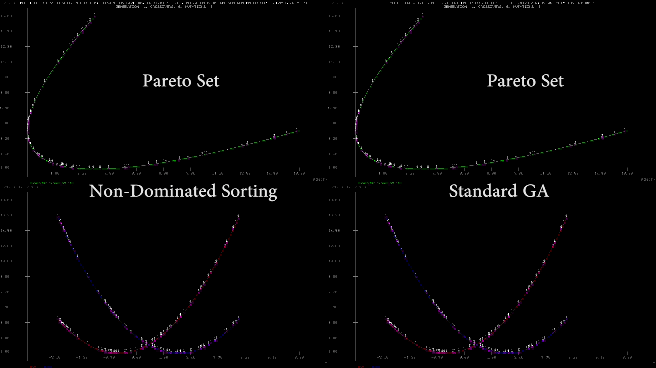

Multi-Objective Genetic Algorithm

Searching for the optimal Pareto Set via Genetic Algorithm

Two techniques are compared - the VEGA(Vector Evaluated Genetic Algorithm) approach and Goldberg's idea for Non-Dominated Sorting. The first one divides the populations to several subpopulations(exactly as how many are the objectives) with champions in each for every objective. Then they are shuffled in a new population and random selection of mates from that population is followed by normal crossover and mutations. The second one identifies the front of the Pareto Set approximation for non-dominated individuals and assigns them high rank(which is then shared between neighbours to degrade it and form niches). Then the front is removed and from the rest of the population and a new front is identified giving a new rank lower than the minimum from the previous front. After the population is ranked normal selection, mating, crossover and mutation is performed using the rank as a fitness.

Implementation is in Lua and is based on David E. Goldberg's book "Genetic Algorithms: In Search, Optimization and Machine Learning".

Saving to a BMP file is performed in pure LUA and therefore is pretty slow.
